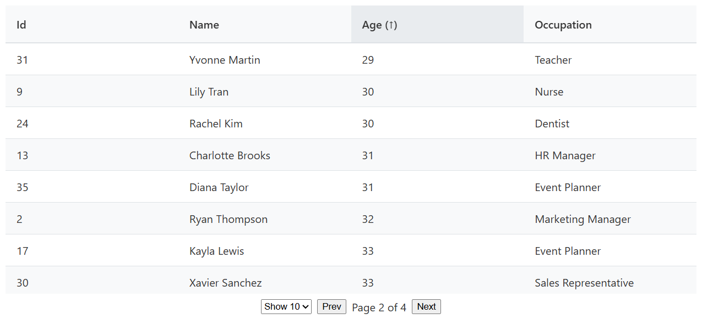

# Angular Data Table Component

A modern, signal-based data table built with Angular 20, demonstrating clean architecture and reactive patterns.

## Key Features

### Core Architecture

- Built with **Angular 20** using standalone components
- **Zoneless** change detection (experimental)
- **Signal-based** state management (`signal`, `computed`, `effect`, `model`)

### Data Handling

- **Generic type support** (`<T extends object>`) for any data structure
- Dynamic column detection from data keys
- Optional pagination and sorting

### Technical Highlights

- Uses experimental [HttpResourceRef](https://angular.dev/guide/http/http-resource) for data loading
- Pure signals for reactivity (no RxJS operators)
- Minimal change detection through zoneless mode

## Usage

```typescript
@Component({
  imports: [DataTable],
  template: `<app-data-table [dataResource$]="usersResource" [pageSize$]="10" />`,
})
export class UserComponent {
  usersResource = inject(ResourceHttp).usersResource;
}
```

## Implementation Notes

- Column headers are generated automatically from data keys
- Sorting is handled via clickable headers
- All state managed through Angular signals

This implementation demonstrates modern Angular patterns suitable for production use.



---

This project was generated using [Angular CLI](https://github.com/angular/angular-cli) version 20.0.4.
